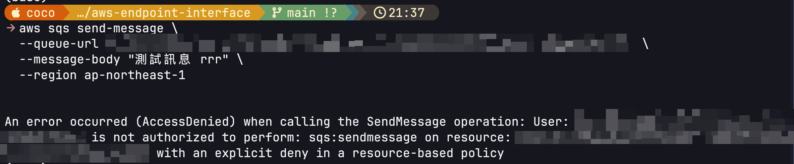
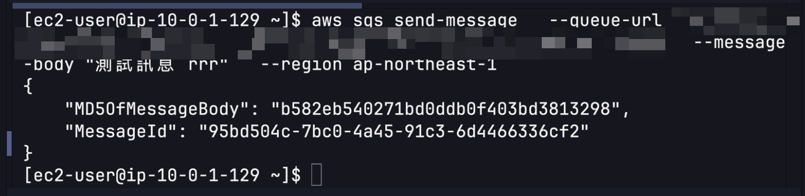

## 什麼是 SQS
SQS 是 Amazon 提供的隊列服務，可以讓不同應用程式之間進行非同步通訊。它允許您將訊息發送到隊列，並在後續的時間點再從隊列中讀取這些訊息。SQS 可以用於各種場景，例如工作排程、事件驅動的應用程式、微服務間的通訊等。

兩種佇列類型

1. 標準佇列(Standard Queue)
- 幾乎無限的吞吐量
- 至少一次傳遞(可能重複)
- 盡力保證順序
<br>
2. FIFO 佇列(First-In-First-Out Queue)
- 保證訊息順序
- 正好一次處理(無重複)
- 吞吐量較標準佇列低(每秒最多 3000 則訊息)

沒有連線 vpc時使用：
```bash
aws sqs send-message \
  --queue-url "$SQS_QUEUE_URL" \
  --message-body "測試訊息 rrr" \
  --region ap-northeast-1a
```


## 設定 EC2 Instance Profile

使用 VPC 中的 EC2 進行連線測試前，需要先附加 IAM Instance Profile 給 EC2 實例。

### 1. 執行 Terraform 建立 IAM 資源

```bash
terraform apply
```

執行後會輸出 `ec2_instance_profile_name`，例如：`coco-endpoint-vpc-ec2-profile`

### 2. 附加 Instance Profile 到現有的 EC2

**方法 A: 透過 AWS Console**
1. 進入 EC2 Console
2. 選擇你的 EC2 實例
3. Actions → Security → Modify IAM role
4. 選擇 `coco-endpoint-vpc-ec2-profile`
5. 點擊 Update IAM role

**方法 B: 透過 AWS CLI**
```bash
# 取得 instance profile 名稱
terraform output ec2_instance_profile_name

# 附加到 EC2 (替換 i-xxxxx 為你的 instance ID)
aws ec2 associate-iam-instance-profile \
  --instance-id i-xxxxx \
  --iam-instance-profile Name=coco-endpoint-vpc-ec2-profile
```

### 3. 在 EC2 上測試 SQS 連線

附加 Instance Profile 後，**不需要執行 `aws configure` 或提供任何憑證**，EC2 會自動使用 IAM Role 的權限。

```bash
# 直接執行，無需登入
aws sqs send-message \
  --queue-url "$SQS_QUEUE_URL" \
  --message-body "測試訊息 from VPC" \
  --region ap-northeast-1
```

注意：區域參數應該是 `ap-northeast-1`，不是 `ap-northeast-1a` (後者是 availability zone)


